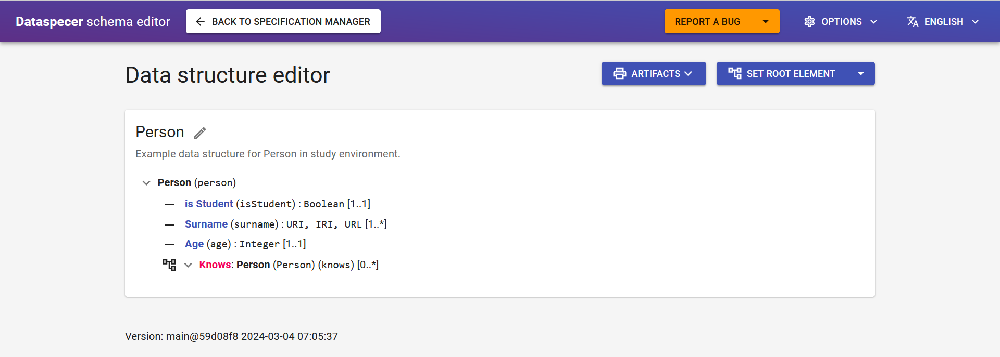
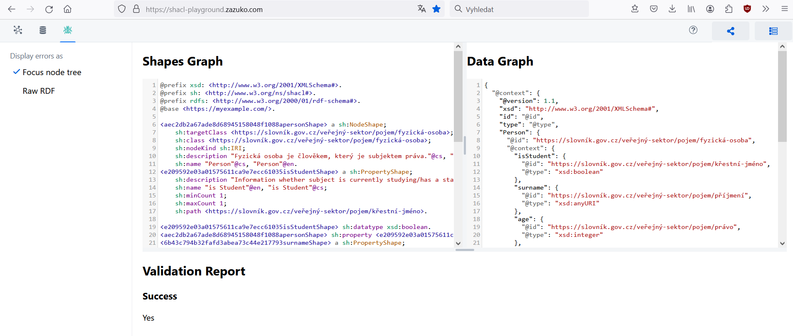
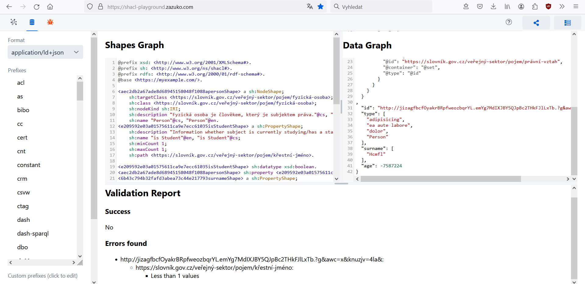
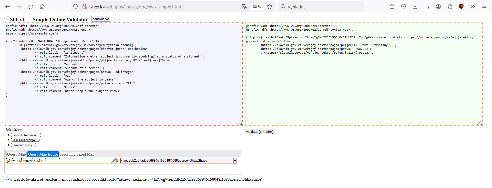

# Trying out validating data with SHACL and ShEx from Dataspecer

This manual has been created after encountering some unstability with the online validators and so that you can try validating the data with the artifact generated in Dataspecer, this guide gives precise examples, providing data structures to try the validation on, along with generated validating schemas and provided data.
Online validators used for this tutorial
 - SHACL: [SHACL Playground from zazuko](https://shacl-playground.zazuko.com/)
 - ShEx: [ShEx2 - Simple Online Validator](http://shex.io/webapps/shex.js/doc/shex-simple.html)
If the validation with online validators does not work, there might be different issues at hand with the compatibility of the validators or the supplied data. SHACL and ShEx generators are being automatically tested for syntax and functionality with every Dataspecer iteration so there should not be any issue in the validating schemas themselves.

The example data structure is this Person data structure, that has been renamed from its previous IRIs to something to better showcase the example. The datatypes to this data structure have been chosen to be different and to see the data type in different forms.

Data structure: https://tool.dataspecer.com/editor?data-specification=https%3A%2F%2Fofn.gov.cz%2Fdata-specification%2F1ef6ae8e-53f5-4ed0-9021-e122fed28be7&data-psm-schema=https%3A%2F%2Fofn.gov.cz%2Fschema%2F1707267359524-5100-047c-992c



Generated SHACL schema:
```
@prefix xsd: <http://www.w3.org/2001/XMLSchema#>.
@prefix sh: <http://www.w3.org/ns/shacl#>.
@prefix rdfs: <http://www.w3.org/2000/01/rdf-schema#>.
@base <https://myexample.com/>.

<aec2db2a67ade8d68945158048f1088apersonShape> a sh:NodeShape;
    sh:targetClass <https://slovník.gov.cz/veřejný-sektor/pojem/fyzická-osoba>;
    sh:class <https://slovník.gov.cz/veřejný-sektor/pojem/fyzická-osoba>;
    sh:nodeKind sh:IRI;
    sh:description "Fyzická osoba je člověkem, který je subjektem práva."@cs, "Natural Person is a human as a legal subject."@en;
    sh:name "Person"@cs, "Person"@en.
<e209592e03a01575611ca9e7ecc61035isStudentShape> a sh:PropertyShape;
    sh:description "Information whether subject is currently studying/has a status of a student"@cs, "Human First name"@en;
    sh:name "is Student"@en, "is Student"@cs;
    sh:minCount 1;
    sh:maxCount 1;
    sh:path <https://slovník.gov.cz/veřejný-sektor/pojem/křestní-jméno>.

<e209592e03a01575611ca9e7ecc61035isStudentShape> sh:datatype xsd:boolean.
<aec2db2a67ade8d68945158048f1088apersonShape> sh:property <e209592e03a01575611ca9e7ecc61035isStudentShape>.
<6b43c794b32fafd3abea73c44e217793surnameShape> a sh:PropertyShape;
    sh:description "Surname of a person"@cs, "Human Surname"@en;
    sh:name "Surname"@en, "Příjmení"@cs;
    sh:minCount 1;
    sh:path <https://slovník.gov.cz/veřejný-sektor/pojem/příjmení>;
    sh:datatype xsd:anyURI;
    sh:pattern "^[A-Z][a-z]*$".
<aec2db2a67ade8d68945158048f1088apersonShape> sh:property <6b43c794b32fafd3abea73c44e217793surnameShape>.
<e4b5012e40ff23016694d283210090a0ageShape> a sh:PropertyShape;
    sh:description "Age of the subject in years"@cs, "Age of the subject in years"@en;
    sh:name "Age"@en, "Právo"@cs;
    sh:minCount 1;
    sh:maxCount 1;
    sh:path <https://slovník.gov.cz/veřejný-sektor/pojem/právo>;
    sh:datatype xsd:integer.
<aec2db2a67ade8d68945158048f1088apersonShape> sh:property <e4b5012e40ff23016694d283210090a0ageShape>.
<8a2bb2d122a69acce8e4efc0cb766b54knowsShape> a sh:PropertyShape;
    sh:description "Other people the subject knows"@cs, "Other people the subject knows"@en;
    sh:name "Knows"@en, "Právní vztah"@cs;
    sh:path <https://slovník.gov.cz/veřejný-sektor/pojem/právní-vztah>;
    sh:nodeKind sh:IRI.
<aec2db2a67ade8d68945158048f1088apersonShape> sh:property <8a2bb2d122a69acce8e4efc0cb766b54knowsShape>.
```
Generated json-example:
```
{
  "@context": {
    "@version": 1.1,
    "xsd": "http://www.w3.org/2001/XMLSchema#",
    "id": "@id",
    "type": "@type",
    "Person": {
      "@id": "https://slovník.gov.cz/veřejný-sektor/pojem/fyzická-osoba",
      "@context": {
        "isStudent": {
          "@id": "https://slovník.gov.cz/veřejný-sektor/pojem/křestní-jméno",
          "@type": "xsd:boolean"
        },
        "surname": {
          "@id": "https://slovník.gov.cz/veřejný-sektor/pojem/příjmení",
          "@type": "xsd:anyURI"
        },
        "age": {
          "@id": "https://slovník.gov.cz/veřejný-sektor/pojem/právo",
          "@type": "xsd:integer"
        },
        "knows": {
          "@id": "https://slovník.gov.cz/veřejný-sektor/pojem/právní-vztah",
          "@container": "@set",
          "@type": "@id"
        }
      }
    }
  }
,
  "id": "http://jizagfbcfOyakrBRpfweozbqrYL.emYg7MdIXJBY5QJpBc2THkFJlLxTb.?g&awc=x&knuzjv=4la&",
  "type": [
    "adipisicing",
    "ea aute labore",
    "dolor",
    "Person"
  ],
  "isStudent": true,
  "surname": [
    "Hcmfl"
  ],
  "age": -7587224
}
```

If we input this data to SHACL validator, we see, that data is conformant. 



For an example on non-conformant data, let's try to delete the required attribute "isStudent". Now the data looks like this:

```
{
  "@context": {
    "@version": 1.1,
    "xsd": "http://www.w3.org/2001/XMLSchema#",
    "id": "@id",
    "type": "@type",
    "Person": {
      "@id": "https://slovník.gov.cz/veřejný-sektor/pojem/fyzická-osoba",
      "@context": {
        "isStudent": {
          "@id": "https://slovník.gov.cz/veřejný-sektor/pojem/křestní-jméno",
          "@type": "xsd:boolean"
        },
        "surname": {
          "@id": "https://slovník.gov.cz/veřejný-sektor/pojem/příjmení",
          "@type": "xsd:anyURI"
        },
        "age": {
          "@id": "https://slovník.gov.cz/veřejný-sektor/pojem/právo",
          "@type": "xsd:integer"
        },
        "knows": {
          "@id": "https://slovník.gov.cz/veřejný-sektor/pojem/právní-vztah",
          "@container": "@set",
          "@type": "@id"
        }
      }
    }
  }
,
  "id": "http://jizagfbcfOyakrBRpfweozbqrYL.emYg7MdIXJBY5QJpBc2THkFJlLxTb.?g&awc=x&knuzjv=4la&",
  "type": [
    "adipisicing",
    "ea aute labore",
    "dolor",
    "Person"
  ],
  "surname": [
    "Hcmfl"
  ],
  "age": -7587224
}
```
Then the validation in SHACL fails, because the data is missing "isStudent" attribute, that is mandatory by set cardinality in data structure.



For validation in Shex, we have to delete extra types from data for the data to be validated correctly. SHACL checks, whether data has a given class type, whether ShEx checks, that the data do not have any other than stated class type. Our json-example produced multiple class types so we have to delete those first 3 in "type" so that only "Person" remains. 

Now because the shex validator only takes TURTLE format, we use an online data converter [RDF Converter](https://converter.zazuko.com/) to convert JSON-LD data to TURTLE.

The final data output for ShEx testing is following:

```
@prefix xsd: <http://www.w3.org/2001/XMLSchema#> .
@prefix rdf: <http://www.w3.org/1999/02/22-rdf-syntax-ns#> .

<http://jizagfbcfOyakrBRpfweozbqrYL.emYg7MdIXJBY5QJpBc2THkFJlLxTb.?g&awc=x&knuzjv=4la&> <https://slovník.gov.cz/veřejný-sektor/pojem/křestní-jméno> true ;
	<https://slovník.gov.cz/veřejný-sektor/pojem/příjmení> "Hcmfl"^^xsd:anyURI ;
	<https://slovník.gov.cz/veřejný-sektor/pojem/právo> -7587224 ;
	a <https://slovník.gov.cz/veřejný-sektor/pojem/fyzická-osoba> .
```

Let's put it into the right side of ShEx validator, that is where data goes. 

Let's generate the ShEx Shape from Dataspecer:

```
prefix rdfs: <http://www.w3.org/2000/01/rdf-schema#>
prefix xsd: <http://www.w3.org/2001/XMLSchema#>
base <https://myexample.com/>

<aec2db2a67ade8d68945158048f1088apersonShExShape> IRI{
	a [<https://slovník.gov.cz/veřejný-sektor/pojem/fyzická-osoba>] ;
	<https://slovník.gov.cz/veřejný-sektor/pojem/křestní-jméno> xsd:boolean
		// rdfs:label	"is Student"
		// rdfs:comment	"Information whether subject is currently studying/has a status of a student" ;
	<https://slovník.gov.cz/veřejný-sektor/pojem/příjmení> xsd:anyURI /^[A-Z][a-z]*$/ +
		// rdfs:label	"Surname"
		// rdfs:comment	"Surname of a person" ;
	<https://slovník.gov.cz/veřejný-sektor/pojem/právo> xsd:integer
		// rdfs:label	"Age"
		// rdfs:comment	"Age of the subject in years" ;
	<https://slovník.gov.cz/veřejný-sektor/pojem/právní-vztah> IRI *
		// rdfs:label	"Knows"
		// rdfs:comment	"Other people the subject knows"
}
```

Now let's input the ShEx shape to the left side.

Now comes the hard part as the validator does not work properly with Query Shapes Maps. If the 
Click on "Query Map Editor".
To the left input window, copy the data node IRI: <http://jizagfbcfOyakrBRpfweozbqrYL.emYg7MdIXJBY5QJpBc2THkFJlLxTb.?g&awc=x&knuzjv=4la&>
To the right input window, copy the shape IRI: <aec2db2a67ade8d68945158048f1088apersonShExShape>

This input to Shape map means, that the validator is going to be testing the data nodes on the left against the ShEx Shape specified on the right.

Other edit that we can do is to copy our generated Shex Query Map from Dataspecer:

```
{ FOCUS rdf:type <https://slovník.gov.cz/veřejný-sektor/pojem/fyzická-osoba>}@<https://myexample.com/aec2db2a67ade8d68945158048f1088apersonShExShape>
```
Paste this into Query Map input and instead of <https://slovník.gov.cz/veřejný-sektor/pojem/fyzická-osoba> which is problematic for the validator to process, input underscore "_". So now the query looks like this:

```
{ FOCUS rdf:type _}@<https://myexample.com/aec2db2a67ade8d68945158048f1088apersonShExShape>
```

Now after clicking the validation button, we see, the data is conformant:


Let's again delete the "isStudent" attribute from the data. Now the data looks like this:
```
@prefix xsd: <http://www.w3.org/2001/XMLSchema#> .
@prefix rdf: <http://www.w3.org/1999/02/22-rdf-syntax-ns#> .

<http://jizagfbcfOyakrBRpfweozbqrYL.emYg7MdIXJBY5QJpBc2THkFJlLxTb.?g&awc=x&knuzjv=4la&> 
	<https://slovník.gov.cz/veřejný-sektor/pojem/příjmení> "Hcmfl"^^xsd:anyURI ;
	<https://slovník.gov.cz/veřejný-sektor/pojem/právo> -7587224 ;
	a <https://slovník.gov.cz/veřejný-sektor/pojem/fyzická-osoba> .
```

We again get nonconformant data and the validator shows us the result:

